# llms-evaluation-msbi
A Microsoft Business Intelligence (MSBI) solution for evaluating and benchmarking Large Language Models (LLMs) using real-world benchmark data. This project implements a complete BI pipeline with SSIS (ETL), SSAS (OLAP Cube), and Power BI visualizations to centralize, structure, and analyze the performance of open-source LLMs.

## Table of Contents
1. [Project Overview](#project-overview)
2. [Authors & Organization](#authors--organization)
3. [Motivation & Problem Statement](#motivation--problem-statement)
4. [Objectives](#objectives)
5. [Tech Stack](#tech-stack)
6. [Architecture & Components](#architecture--components)
7. [Data Warehouse Modeling & Granularity Matrix](#data-warehouse-modeling--granularity-matrix)
8. [ETL Process (SSIS)](#etl-process-ssis)
9. [OLAP Cube (SSAS)](#olap-cube-ssas)
10. [Power BI Reports & KPIs](#power-bi-reports--kpis)
11. [Video](#Video)

## 1. Project Overview
The project addresses the challenge of evaluating and benchmarking Large Language Models (LLMs) by centralizing, structuring, and analyzing their performance data. Evaluation results are currently scattered across CSV files, model cards, and scientific articles, making comparison and analysis difficult. The solution involves building a dedicated Data Warehouse, automating ETL processes, and enabling multidimensional analysis and visualization using Microsoft BI tools (SSIS, SSAS, Power BI). The project enables standardized, reproducible, and dynamic analysis of LLM performance across various benchmarks and dimensions.

## 2. Authors & Organization
This project was realized by Rachid Benyakhlef and Amine Ez-zahrouy, under the supervision of Mme. Benhiba, as part of a school project at ENSIAS (National School of Computer Science and Systems Analysis).

## 3. Motivation & Problem Statement
The rapid development and diversity of LLMs have made their evaluation increasingly complex. Results are often dispersed and lack standardization, leading to difficulties in comparison, traceability, and reproducibility. This project addresses these challenges by providing a structured and centralized approach for analyzing LLM performance, enabling reliable and efficient benchmarking for researchers and analysts.

## 4. Objectives
The main objectives of this project are:
- Consolidate and structure LLM evaluation results in a dedicated Data Warehouse.
- Enable comparative and multidimensional analysis of model performance across various axes (benchmark, generation, evaluation type, size, etc.).
- Automate the extraction, transformation, and loading (ETL) of raw data into the Data Warehouse.
- Ensure traceability, standardization, and reproducibility of analyses.
- Facilitate data exploration and retrieval through the implementation of analytical cubes and dynamic visualizations.

## 5. Tech Stack
The solution is built on the following technologies:
- Microsoft SQL Server (database and data warehouse)
- SQL Server Integration Services (SSIS) for ETL processes
- SQL Server Analysis Services (SSAS) for OLAP cubes
- Power BI for data visualization and reporting

## 6. Architecture & Components
The architecture consists of several integrated components:
 - Data sources (CSV, Excel) are cleaned and prepared before loading.
 - A staging area in SQL Server stores raw data for initial processing.
 - SSIS handles ETL workflows, extracting, transforming, and loading data into the Data Warehouse.
 - The Data Warehouse uses a star schema with fact and dimension tables for efficient analysis.
 - SSAS builds OLAP cubes from the warehouse, enabling multidimensional queries and aggregations.
 - Power BI connects to the OLAP cubes for dynamic reporting and visualization.
This pipeline ensures data quality, integrity, and supports advanced analytics and decision-making.

## Data Sources

The benchmark data used in this project was obtained from the official EvalLLM leaderboard and its associated CSV file:

- [CSV file of LLM models and evaluation results](https://github.com/fboulnois/llm-leaderboard-csv/blob/main/csv/huggingface_v2.csv)
- [Huggingface Open LLM Leaderboard](https://huggingface.co/spaces/open-llm-leaderboard/open_llm_leaderboard#/)

These sources provide detailed information on LLM models, their evaluation results, environmental impact, and more.

## 7. Data Warehouse Modeling & Granularity Matrix

Before implementing the ETL process, a thorough modeling phase was conducted to define the structure and analytical capabilities of the Data Warehouse. This phase involved identifying key facts (measures) and analytical dimensions, which form the foundation for multidimensional analysis.

### Identification of Facts and Dimensions

**Key Measures and KPIs (Facts):**
- **Benchmark Value:** Raw score obtained by a model on a specific benchmark.
- **Benchmark Normalized Score:** Standardized score for cross-benchmark comparison.
- **Model Average Score:** Average performance of a model across all tasks.
- **Metadata Hub Hearts:** Popularity metric (e.g., number of "likes" on Hugging Face).
- **Metadata CO2 Cost:** Estimated environmental cost of model training.
- **Metadata Params Billions:** Model size (number of parameters in billions).

**Analytical Dimensions:**
- **Model (Dim Modele):** Tracks evolution and characteristics of each model (name, generation, type, architecture, etc.).
- **Benchmark (Dim Benchmark):** Analyzes results by evaluation task.
- **Date (Dim Date):** Enables temporal analysis (submission, publication dates, etc.).
- **Technical Characteristics (Dim Caracteristiques):** Explores specific technical attributes (chat template, merged, flagged, provider, etc.).
- **Metadata (Dim Metadonnees):** Contextual information such as license, generation, provider, etc.

These facts and dimensions were used to construct the granularity matrix, which determines the level of detail for each fact table and guides the final star schema design.

### Granularity Matrix Design

The granularity matrix defines the intersection of dimensions and measures, specifying the grain of each fact table. This ensures that analytical queries are both flexible and performant.

- **Fact ResultatsBenchmark:** Detailed results per model, per benchmark, per date, with associated technical characteristics and metadata.
- **Fact ModeleAggregate:** Aggregated measures per model, such as average scores, popularity, and environmental cost.

### Granularity Matrix

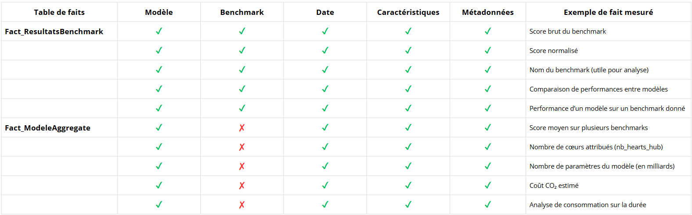

### Star Schema

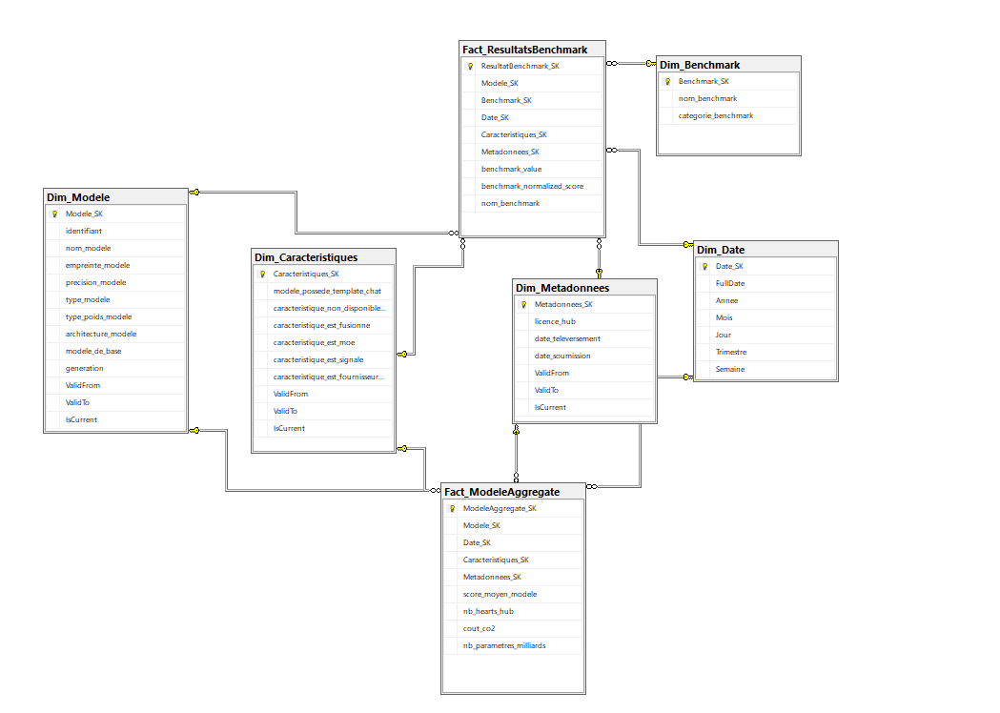

This modeling phase established a robust foundation for the subsequent ETL implementation and analytical workflows.

## 8. ETL Process (SSIS)

### 8.1 Preparation and Import of Source Files

Before integration into the decision system, a crucial data preparation and cleaning phase was performed using the pandas library in Python. The goal was to ensure data quality, consistency, and compatibility with the requirements of a data warehouse.

Main transformations included:
- **Format change:** The source file, initially in CSV format, was converted to Excel (XLSX) for better structure and visualization.
- **Data type corrections:** Automatic conversion of numeric values (scores, costs, etc.), boolean fields (TRUE/FALSE), and date fields to appropriate types.
- **Text value cleaning:** Removal of extra spaces, quotes, or unwanted characters to ensure clean strings.
- **Advanced handling of missing values:** Replacement of missing identifiers or categories with "Unknown" or the most frequent value, imputation of missing numeric values with the column median, and replacement of missing dates with `1970-01-01`.
- **Data structure and quality treatment:** Removal of rows with more than 50% missing values, standardization and normalization for consistency.
- **Data warehouse compatibility:** The final dataset is clean, typed, consistent, and ready for loading into the warehouse.

This preparation ensures that future analyses are based on reliable and usable data.

### 8.2 Creation of the Source Database in SQL Server

After cleaning, the Excel file was imported into a relational database named **LLM Staging** in SQL Server.

- Column types were carefully checked and adapted to match the cleaned source data.
- The import was performed using the **Import Flat File** wizard, loading data into a table named `source`.
- The source table serves as a staging area prior to integration and transformation into the final Data Warehouse.

### 8.3 SSIS ETL Implementation

#### 8.3.1 Connection Manager

The first step in configuring an SSIS project is to define Connection Managers, which act as gateways between data sources and destinations.

- Two connectors were created:
  - `localhost.LLM Staging`: connects to the source database with raw data from staging.
  - `localhost.LLMs DW`: connects to the target Data Warehouse.
- These connectors allow each SSIS component (Source, Destination, Lookup, etc.) to access the relevant tables for extraction or loading.
- This step ensures communication between SSIS and the SQL Server databases used throughout the ETL process.

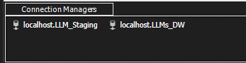

#### 8.3.2 Control Flow Overview

The diagram below illustrates the main Control Flow in SSIS for populating the EvalLLM Data Warehouse. Each task corresponds to loading a dimension or fact table, following the previously defined star schema.

- **Model, Characteristics, Metadata, Date, Benchmark:** Data Flow tasks for loading respective dimensions from the staging table.
- **LoadFactResultatBenchmark:** Integrates detailed performance facts (by benchmark) into the `Fact ResultatsBenchmark` table, performing necessary joins with loaded dimensions.
- **Fact ModeleAggregate:** Loads aggregated measures per model into the dedicated fact table, using dimensions and performing required aggregations.

The architecture ensures each dimension is populated before loading fact tables, maintaining foreign key relationships and referential integrity. This sequencing enables a robust, automated ETL process tailored to the project's star schema.

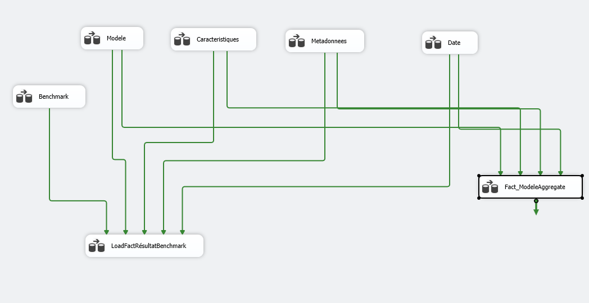

#### 8.3.3 Data Flow Details

Each data flow (Data Flow) is detailed individually. For each dimension or fact table, a specific Data Flow was designed for mapping, transformation, and appropriate loading from staging to the Data Warehouse.

- **Dimension Example (Dim Modele):**
  - Configures the OLE DB destination in SSIS for loading transformed data into the `Dim Modele` table.
  - Specifies the target database connection, access mode, and destination table name.
  - Defines column mappings between input and destination columns, ensuring integrity and consistency.

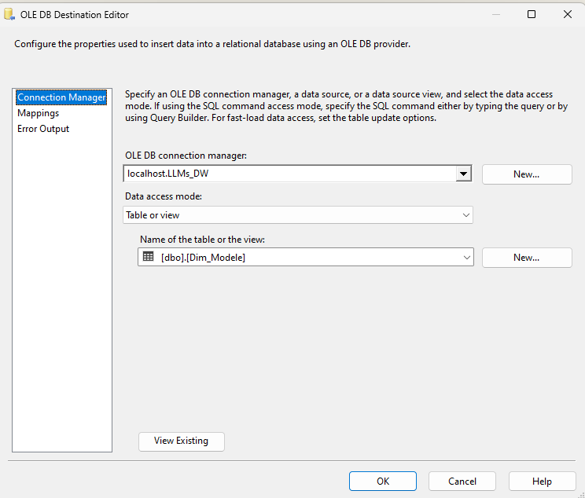
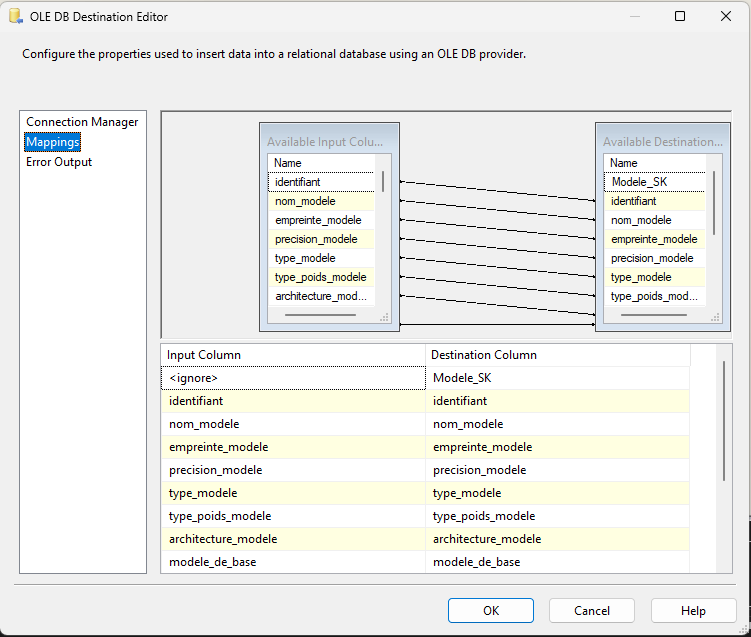

- **Fact Table Example (Fact ResultatsBenchmark):**
  - Data flow starts with an OLE DB source extracting data from staging.
  - Multiple Lookup components retrieve surrogate keys for dimensions (Benchmark, Model, Date, Metadata, Characteristics) via joins.
  - Keys are added to the main data flow, ensuring correct linkage between facts and dimensions.
  - Enriched data is loaded into the fact table, ensuring referential integrity.

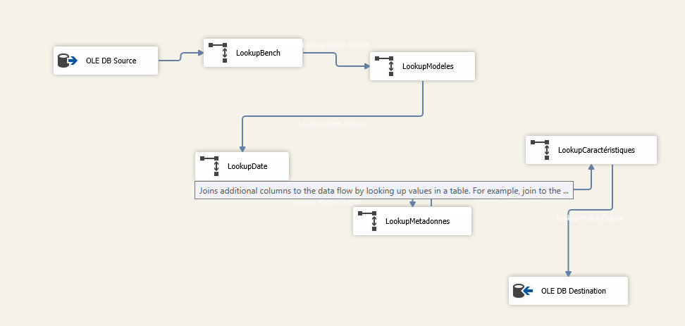

- **Fact Table Example (Fact ModeleAggregate):**
  - After extracting source data via OLE DB Source, Lookup components retrieve dimension identifiers (Date, Characteristics, Metadata, Model).
  - Each lookup links facts to surrogate keys of corresponding dimensions.
  - Enriched data is loaded into the OLE DB destination, completing the process for this table.

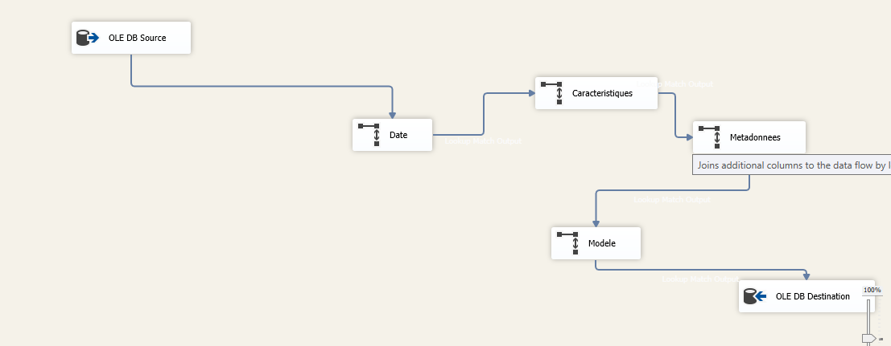

#### 8.3.4 SCD2 Configuration Issue

During the configuration of the Slowly Changing Dimension (SCD) Type 2 component in SSIS, a blocking issue was encountered. Specifically, the dropdown list for selecting the validity date variable was empty.

- Multiple attempts were made to restart the SSIS wizard and the application.
- To meet project deadlines, this step was temporarily set aside, and work continued with fact table loading and cube creation.

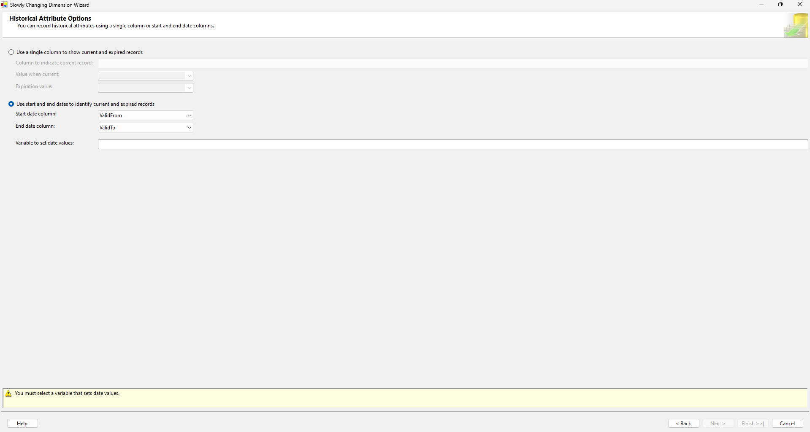

## 9. OLAP Cube (SSAS)

The following figure presents the structure of our SSAS (SQL Server Analysis Services) cube, designed to enable multidimensional analysis of LLM results and characteristics.

### Cube Structure

- **Fact Tables:**
  - **Fact ModeleAggregate:** Aggregates measures by model, such as average score, parameter count, cost, etc.
  - **Fact ResultatsBenchmark:** Contains detailed benchmark results for each model and test run.

- **Dimensions:**
  - **Dim Modele**
  - **Dim Caracteristiques**
  - **Dim Metadonnees**
  - **Dim Date**
  - **Dim Benchmark**

- Relationships between fact tables and dimensions are established using surrogate keys (SK), ensuring referential integrity and consistency during data exploration.

- This star schema structure facilitates the creation of indicators, reports, dashboards, and enables cross-dimensional analysis.

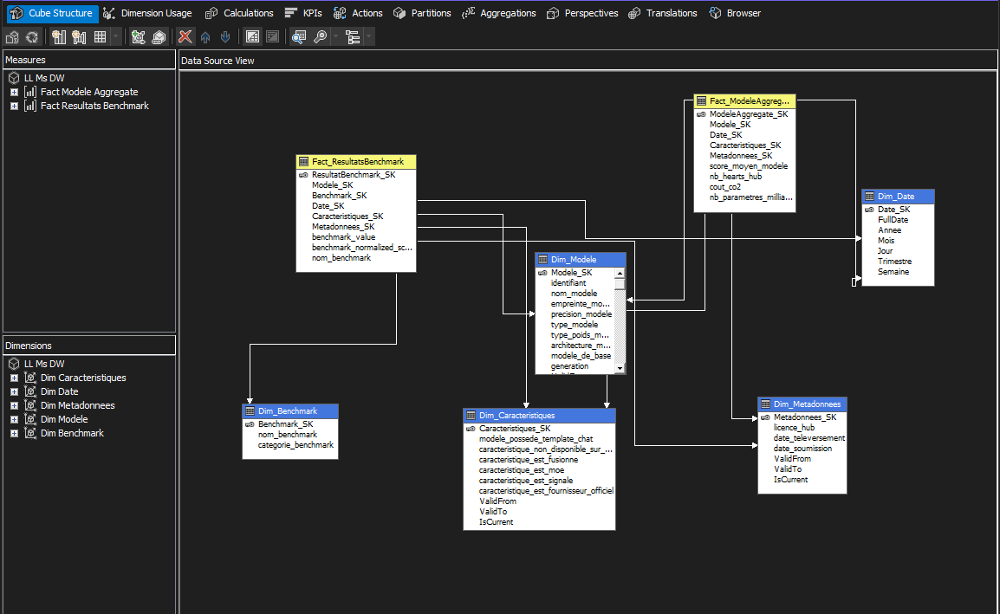

### Dimension Usage in the Cube

The screenshot below illustrates how dimensions are associated with measure groups in our SSAS cube via the "Dimension Usage" tab:

- Each dimension (Dim Caracteristiques, Dim Date, Dim Metadonnees, Dim Modele, Dim Benchmark) is linked to both fact tables (Fact ModeleAggregate and Fact ResultatsBenchmark) through their surrogate keys.
- This linkage enables cross-analysis between measures and dimensions, supporting flexible multidimensional exploration.
- The interface provides a clear view of associations, ensuring all dimensions are properly utilized in the cube for both measure groups.
- Correct configuration at this stage is essential for coherent and rich analyses from the cube.

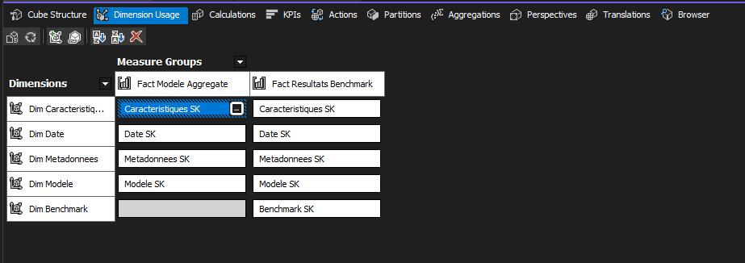

### Cube Exploration via SSMS

The figure below shows the use of SQL Server Management Studio (SSMS) to query and explore the OLAP cube:

- SSMS allows direct connection to the deployed cube on the Analysis Services server.
- The interface supports composing multidimensional queries (MDX) or graphical data exploration.
- Users can select different analysis axes (measures, dimensions, temporal hierarchies, etc.) to obtain aggregations or details as needed.
- This exploration validates the cube’s structure and data presence, facilitating report and dashboard preparation.
- Using SSMS at this stage is essential to verify the integrity and analytical richness of the cube before making it available to end users.

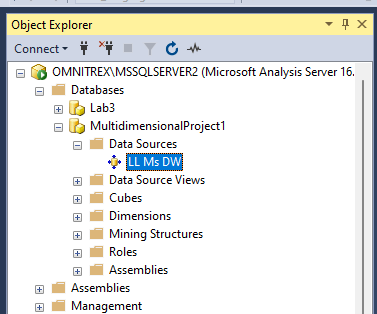

## 10. Power BI Reports & KPIs

### 10.1 Connecting Power BI to the SSAS Cube

Power BI was connected directly to the SSAS cube to enable dynamic reporting and interactive data exploration.

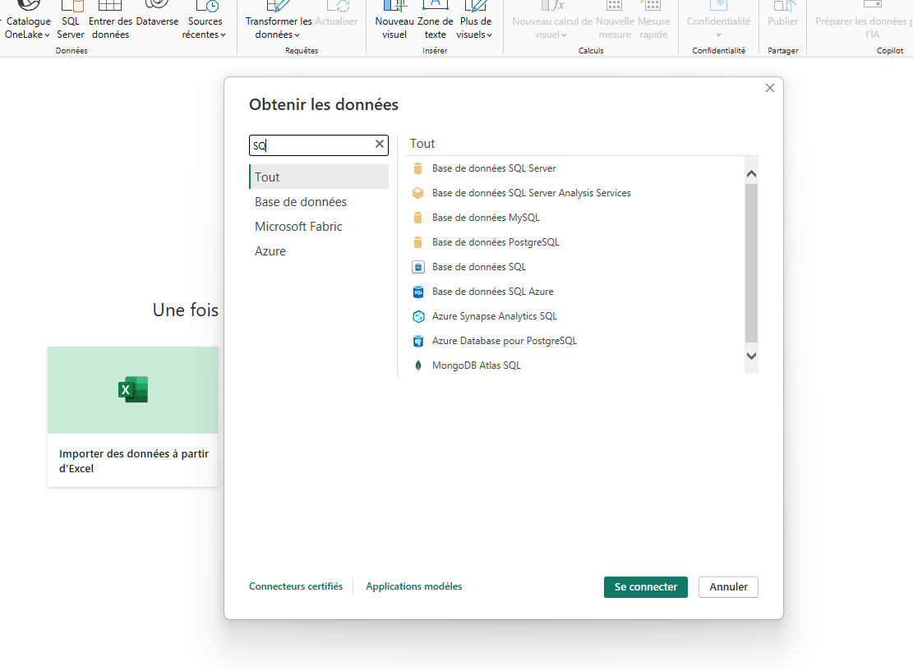

### 10.2 Exploration and Creation of Dynamic Reports

Once the cube was loaded, Power BI enabled the creation of dynamic reports and dashboards, allowing users to analyze model performance and characteristics across multiple dimensions.

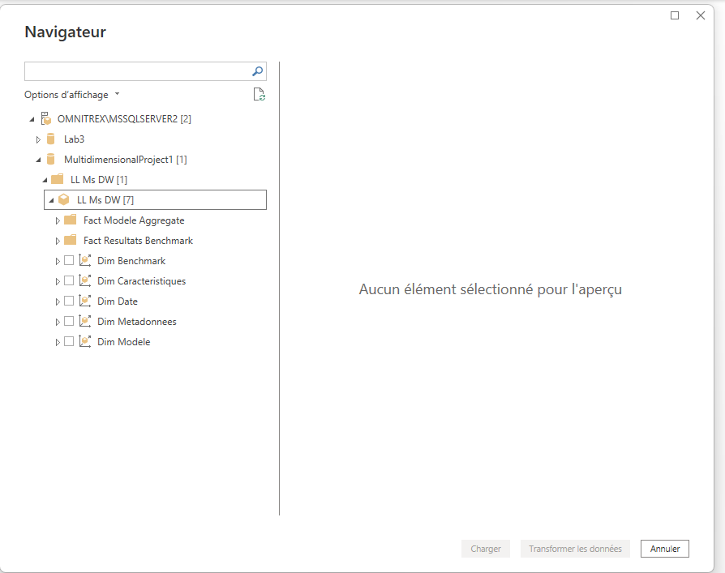

### 10.3 Examples of Visualizations

The figure below presents an interactive dashboard built with Power BI, used to visualize and analyze key performance indicators (KPIs) for the studied language models.

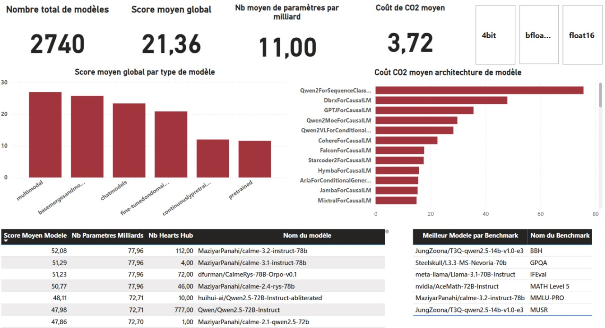

#### 10.3.1 KPI Presentation and Explanation

Main KPIs represented in the dashboard include:
- **Total number of models:** The total count of language models analyzed.
- **Global average score:** Aggregated average performance scores across all models and benchmarks.
- **Average number of parameters (in billions):** Average model size, expressed in billions of parameters.
- **Average CO2 cost:** Estimated average carbon footprint generated during model training or usage.
- **Global average score by model type:** Performance visualization by model category (multimodal, chatmodels, fine-tuned, etc.).
- **Average CO2 cost by model architecture:** Comparison of average carbon footprint by model architecture.
- **Distribution by model precision:** Breakdown of models by numeric precision (4bit, bfloat16, float16, etc.).
- **Top-performing models ranking:** Table showing models with the highest overall performance.
- **Best model per benchmark:** Identification of the top-performing model for each specific benchmark.

#### 10.3.2 KPI Analysis and Interpretation

Analysis of these KPIs highlights several important findings:
- Multimodal and base/merge models show the highest global average scores, indicating better versatility and adaptability.
- Certain architectures, such as Qwen2ForSequenceClassification, have significantly higher average CO2 costs, impacting sustainability choices.
- The average model size (about 11 billion parameters) reflects the growing complexity of current NLP approaches.
- The distribution by numeric precision shows increasing adoption of optimized formats (e.g., 4bit, float16) to reduce environmental impact without major performance loss.
- Ranking and identification of top models per benchmark facilitate quick recognition of the best solutions for each use case.

#### 10.3.3 KPI Relevance for Decision-Making

Selecting and visualizing these KPIs provides real decision support:
- Enables rapid comparison of models across essential criteria (performance, size, environmental cost).
- Tables and charts help identify trade-offs between performance and sustainability.
- Detailed analysis by model type and architecture guides technical choices according to project priorities (efficiency, ecology, robustness, etc.).
- This type of reporting supports continuous benchmarking, which is crucial in the fast-evolving NLP field.

## 11. Conclusion

This project explored the full lifecycle of a modern decision-support solution applied to language model analysis. We designed and populated a data warehouse, modeled an OLAP cube with SSAS, and implemented advanced reporting and visualization tools (SSRS, Power BI). Each step, from data integration to interactive dashboard creation, enhanced understanding of the challenges in leveraging benchmark data from language models.

The use of Microsoft technologies (SQL Server, SSAS, SSRS, Power BI) demonstrated the power and complementarity of these tools for meeting complex analytical needs, while ensuring the flexibility required for data exploration and result presentation. The work was based on real data from public benchmarks, bridging theory with practical use cases.

Finally, this project provided an opportunity to apply knowledge gained from three labs led by our professor, covering data warehouse modeling, OLAP cube design, and advanced report generation.

## 12. Video

Watch a demonstration of the project execution here:  

